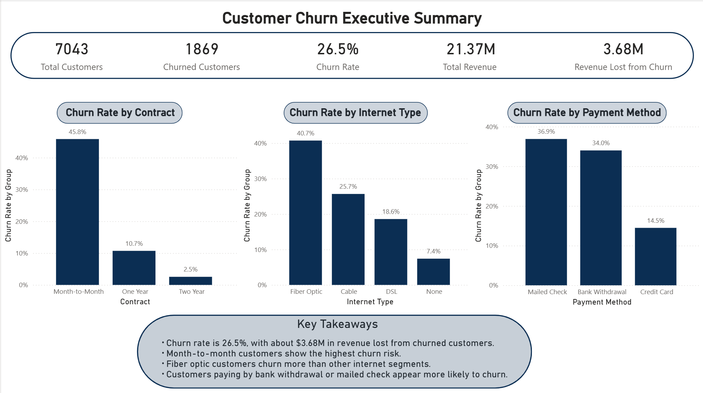
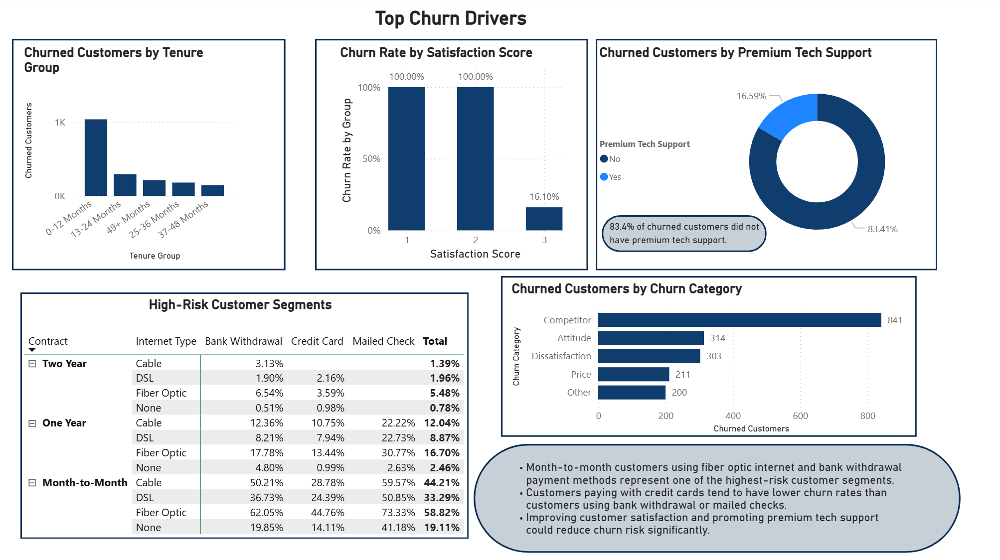
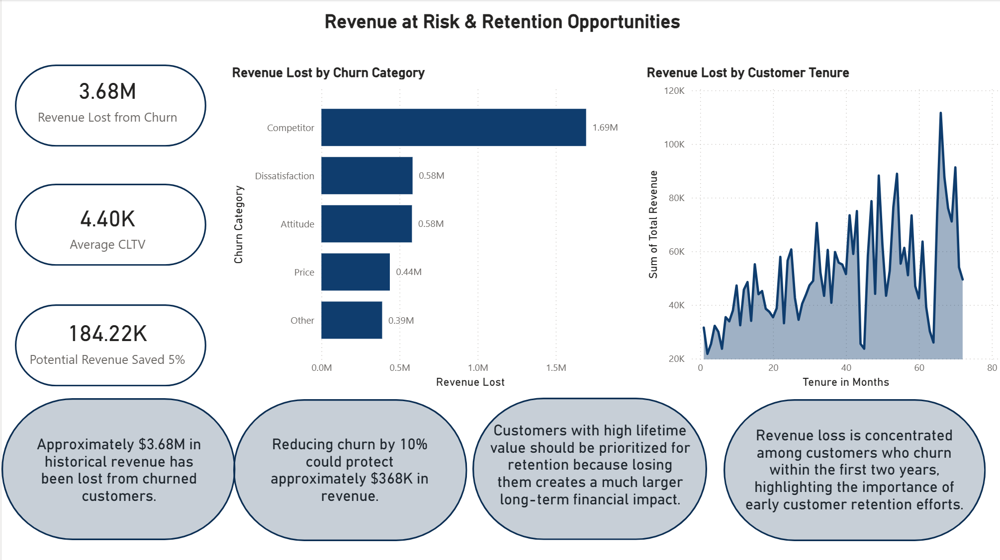

# customer-churn-analysis
Customer Churn Analysis and Executive Dashboard built with Python and Power BI.

## Project Overview
This project analyzes customer churn in a telecom company and identifies the key drivers behind customer loss. The goal is to understand which customers are most likely to churn, estimate the revenue impact of churn, and provide business recommendations to improve customer retention.
The project combines Python for data cleaning and exploratory analysis with Power BI for executive-level dashboards and business storytelling.

## Business Probelm 
Customer churn is one of the biggest challenges for telecom companies because losing customers directly impacts revenue and profitability.

### This project answers important business questions such as:

* Which customers are most likely to churn?
* What factors are driving churn?
* How much revenue is being lost because of churn?
* Which customer segments should the company focus on retaining?
* What actions could reduce churn and improve customer loyalty?

## Tools Used 
* Python
* Pandas
* Power BI
* DAX
* Google Colab
* GitHub

## Dataset 
Dataset source: [Kaggle Telco Customer Churn Dataset](https://www.kaggle.com/datasets/blastchar/telco-customer-churn)

The dataset includes customer demographics, contract information, internet service details, payment methods, satisfaction scores, tenure, churn categories, churn reasons, and revenue metrics.

## Project Workflow
- Data loading and exploration
- Data cleaning and preparation
- Exploratory data analysis (EDA)
- Churn driver analysis
- Revenue impact analysis
- Dashboard creation in Power BI
- Business recommendations

## Key Insights 
* Overall churn rate is 26.5%
* Approximately $3.68M in revenue has been lost from churned customers
* Month-to-month customers have the highest churn rate
* Fiber optic customers are more likely to churn than DSL or cable customers
* Customers without premium tech support are significantly more likely to churn
* Most churned customers leave within the first year
* Competitor-related reasons account for the largest share of lost revenue

## Dashboard Pages 
### Executive Summary

### Top Churn Drivers

### Revenue at Risk

## Business Recommendations 
* Encourage customers to switch to annual contracts
* Improve customer onboarding during the first 12 months
* Promote premium tech support bundles
* Improve fiber optic service quality
* Create targeted retention campaigns for high-risk customers
* Offer loyalty incentives to customers with low satisfaction scores

## Author
Juan DeVolder

Aspiring Data Analyst and Data Engineer

